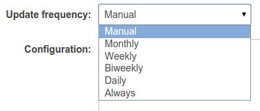

.. _ckan_harvesting:

########################
Harvesting configuration
########################

Adding an harvesting source
===========================

In order to add an harvesting source, you need to log into CKAN web interface as an administrator.
You have to type the address for the harvesting page, since there is no direct link for it ::

   http://YOUR_SITE/harvest

.. figure:: /maint/img/harvest1.png
   :width: 600
   :align: center

Press the "Add Harvest Source" button and this page will open:

.. figure:: /maint/img/harvest2.png
   :width: 600
   :align: center

In order to add properly a CSW source you'll have to set:

* The CSW URL endpoint
* A title/name for this source, for your reference
* The harvest type, i.e. "PBZ CSW Server" in "Source type"
* The update frequency
* The configuration in JSON format.
* The owner Organization: all the dataset harvested from this source will be assigned to that Organization.

The JSON configuration allows these parameters:

* ``cql``: a CQL filter for harvesting only a subset of the records in the remote node
* ``default_tags``: all dataset harvested from this source will have these tags attached.
* ``default_extras``: all dataset harvested from this source will have these key/value pairs attached.
  The value may have tokens in the form ``{token}``, where the allowed tokens are:

  * ``harvest_source_url``
  * ``harvest_source_title``
  * ``harvest_job_id``
  * ``harvest_object_id``

* ``version``: geonetwork version. Currently only 2.6, and 2.10 are accepted. This is needed to find out which services are available on the GeoNetowrk instance. For instance, in order to extract the categories associated to a metadata in version 2.6, the only way to find it is to get a MEF of the metadata and to parse the info.xml file packed into it.
  
* ``private_datasets``:  If True sets as private the dataset. A dataset can be private if belongs to an organization Furthermore these other parameters will be read:

* ``group_mapping``:  it's a dict that associates category names to group names. If this parameter is defined, GN will be queried about the categories of the metadata, a matching group for each category will be searched in the provided mapping and will then be associated to the metadata if one or more are found

* ``harvest_iso_categories``: requires 'group_mapping' defined. If True allow to harvest metadata using ISO categories instead GeoNetwork internal categories.

* ``ckan_locales_mapping``: provides a mapping between CKAN locales and localed in CSW (used for the gmd:LocalisedCharacterString element).

* ``default_license``: with this property you can specify the default license to use for the CKAN's dataset if none useLimitation has been found into the metadata. Below an example:
  
.. note::
   *cql filtering* has been added with `this commit <https://github.com/ckan/ckanext-spatial/commit/55497f037e5add55f5890315e9c7c4f396cc49ac>`_.

.. note::
   ``default_tags`` and ``default_extras`` will be available only if, when installing ckanext-spatial, these commits
   have been included manually::

      https://github.com/ckan/ckanext-spatial/pull/58

Below the configuration used for the Provincia di Bolzano Harvester::

		{
			"private_datasets": "False", 
			"version": "2.6", 
			"harvest_iso_categories": "True",
			"group_mapping": {
				"farming": "farming", 
				"utilitiesCommunication": "boundaries", 
				"transportation": "boundaries", 
				"inlandWaters": "environment", 
				"geoscientificInformation": "geoscientificinformation", 
				"environment": "environment", 
				"climatologyMeteorologyAtmosphere": "climatologymeteorologyatmosphere", 
				"planningCadastre": "boundaries", 
				"imageryBaseMapsEarthCover": "boundaries", 
				"elevation": "boundaries", 
				"boundaries": "boundaries",
				"structure": "boundaries", 
				"location": "boundaries", 
				"economy": "economy",
				"society": "economy",
				"biota": "environment",
				"intelligenceMilitary": "boundaries",
				"oceans": "environment",
				"health": "health"
			},
			"ckan_locales_mapping":{
				"ita": "it",
				"ger": "de"
			},
			"default_license": "cc-zero"
		}

Running the harvesters
======================

In order to have an harvester to fetch the remote datasets, it should be run.

At each run 

- new datasets will be locally added, 
- remotely updated ones will be updated locally as well, and 
- old datasets that cannot be found anymore on the remote site will be locally deleted.  

You can configure the update frequency in this dropdown menu in the harvesting configuration page.   

A background script (installed at paragraph :ref:`install_ckan_harvesting_script`)
that runs every 15 minutes will look for any new reharvesting request and run the
related harvester if needed.

The choice **always** will try and run the selected harvester every time the 15 minutes script runs.
If the previous harvesting run is not finished yet, a new one will not be launched.

The harvesters with frequancy choices **Daily**, **Weekly**, ... will be examined by the script run every 15 minutes.
If the script finds that the last run was over a day ago (or one week, two weeks, etc, according to the choice),
the harvester will be run again.

Harvester with the **manual** choice will never be run automatically:
the harvester run can be triggered by pressing the "`Reharvest`" button in the harvester administration page:
When the "reharvest" button is pressed, the harvesting will run within the next 15 minutes.    

Frequency customizations
------------------------

You may have noted that the harvesting script that has been configured during the CKAN installation have been
slightly customized.

We added the line  containing the ``harvester job-all``, an additional command that will force harvesting from
all the configured sources.
This means that all harvesting sources will be handled as if they have the "Always" frequency set.

If you need some more fine-grained frequency, you should set up your own script, and tell ``cron`` to run it
whenever you need.

.. tip::
   For next instructions you may need some knowledge of the CKAN command line interface 

E.g. Let's say you want to run the Provincia di Bolzano harvester every days.
   
#. Find the code of the harvest source you want to run at your own frequency

   Log into the hub machine as user ``ckan`` and issue the commands::
   
      . /usr/lib/ckan/default/bin/activate 
      paster --plugin=ckanext-harvest harvester sources --config=/etc/ckan/default/production.ini
            
   Last command will run the ``sources`` command on the ``harvester`` plugin. 
   You will get the list of the configured sources::
   
      [...]
   
      Source id: 874fefea-2378-44a3-8c63-3b1503e3d747
            url: http://geoservices.retecivica.bz.it/geonetwork/srv/ita/csw
           type: PBZ CSW Server
         active: True
      frequency: MANUAL
           jobs: 31
              
      There are 1 active harvest sources
      
   We see that the code for the Provincia di Bolzano harvester is ``874fefea-2378-44a3-8c63-3b1503e3d747``.   
         
#. Create a script for running your harvester
 
   Create a script ``/usr/lib/ckan/run_pbz_harvester.sh`` (in the same file system location of the previous one) with this content::  

      . /usr/lib/ckan/default/bin/activate 
      paster --plugin=ckanext-harvest harvester job 874fefea-2378-44a3-8c63-3b1503e3d747 --config=/etc/ckan/default/production.ini
      
   and make it executable ::
   
      chmod +x /usr/lib/ckan/run_pbz_harvester.sh         

#. Tell cron to run your script

   Now we have to tell cron to run the script every 6 hours.
   Open the crontab in editing mode with ``crontab -e`` and add the line ::

      0 8 * * * /usr/lib/ckan/run_pbz_harvester.sh

#. Tell CKAN not to do anything else 

   Set the Provincia di Bolzano harvester update frequency to "manual", so that CKAN will not trigger
   the harvesting on its own.
   Now the harvesting will be run by the cronjob every day. Should you need an "extra" run of the harvester
   you may press the "reharvest" button whenever you like, and it will run within the next 15 minutes as usual.