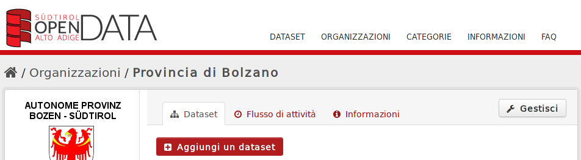
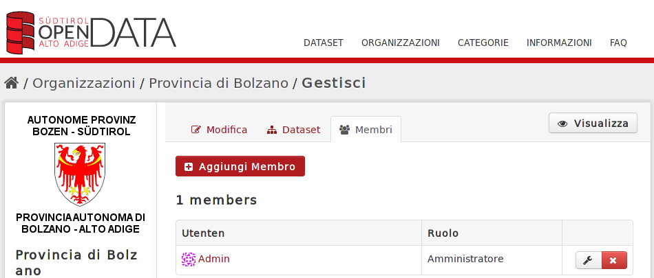
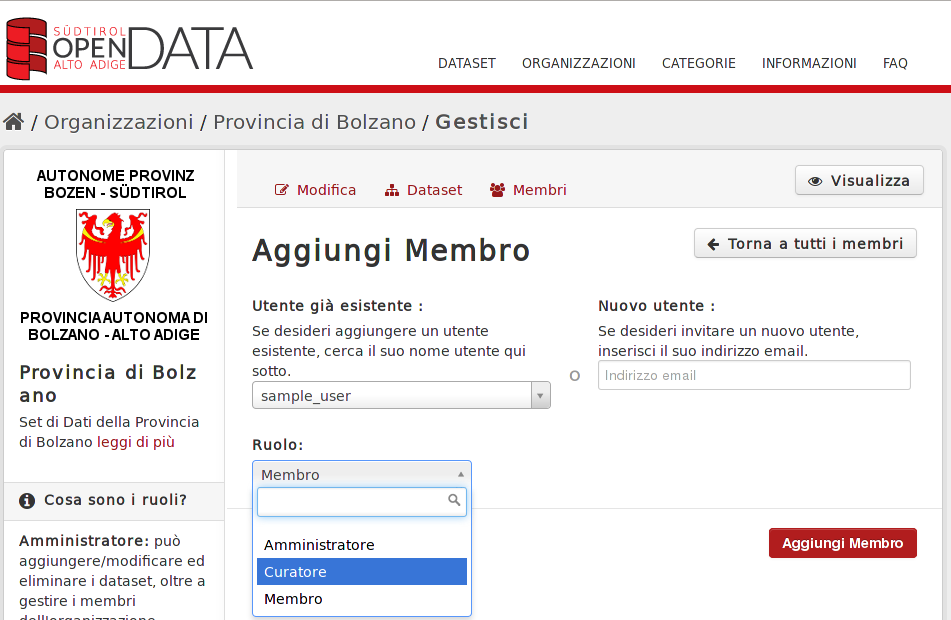

.. _ckan_users_administration:

####################
Users administration
####################

Introduction
============

Once an user logs in the first time through Shibboleth, a User object is created in CKAN.
The Shibboleth plugin creates the user using the information coming from the IdP (Shibboleth Identity Provider),
such as an unique id, a username and optionally an e-mail address.

CKAN has been configured so that datasets can not be created outside an organization. Since the newly created 
user has not organization associated, it will not be able to create or edit any dataset until an administrator
assigns him to at least one organization.  
 

Assign users to organizations
=============================

Log in as an administrator and select an organizations, by clicking on the "Organizations" link on the upper toolbar 
and selecting one of the existing organizations. You will get a page which presents the "Manage" button in the upper right corner:

   
   Organization page

When clicking on the "Manage" button, the sub-toolbar will show the tabs "Edit", "Datasets", "Members":

.. figure:: img/ckan_admin_org_1.png
   :width: 600
   :align: center
   
   Manage organization page

Clicking on "Members" you will see the members belonging to this organization and their role:
   

   
   Manage organisation users
   
In order to add a new member to this organization, press the "Add Member" button.

In the "Add member" page you will have to choose the user to be added, and his role within this organisation.
A user should at least have "Editor" privileges in order to be able to add and edit datasets within an organisation.

   Edit user privileges inside an organisation

Press the "Add user" button. In the member list you'll have your new member associated to the organisation: 
 
.. figure:: img/ckan_admin_org_add_user_2.png
   :width: 600
   :align: center

   Organisation users
   

